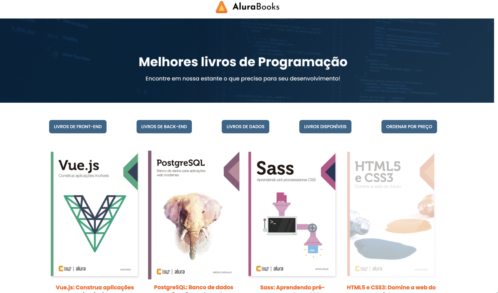

 

 ## Resumo do Projeto

 Projeto realizado durante o curso de Front-End da Alura, visando o apredizado de metodos de array. O projeto foi pensado para um site de vendas de livros

 ## Técnicas e Tecnologias Utilizadas

 - `HTML`
 - `JavaScript`
 - `Metodos de Array`
